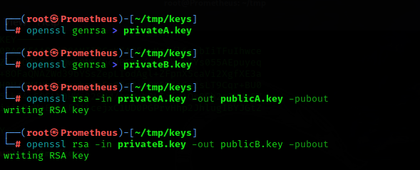
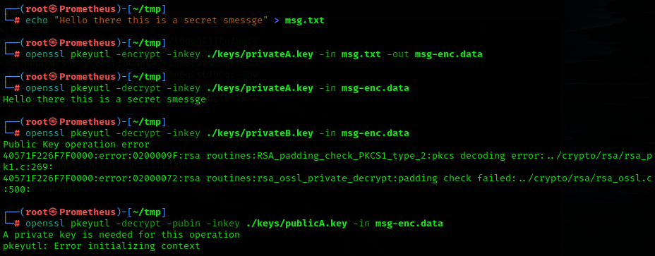
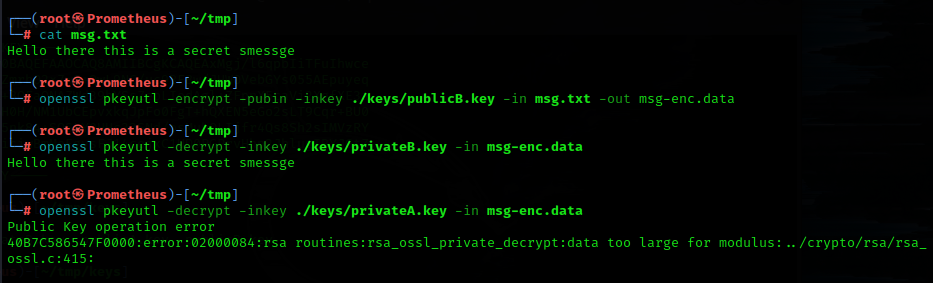
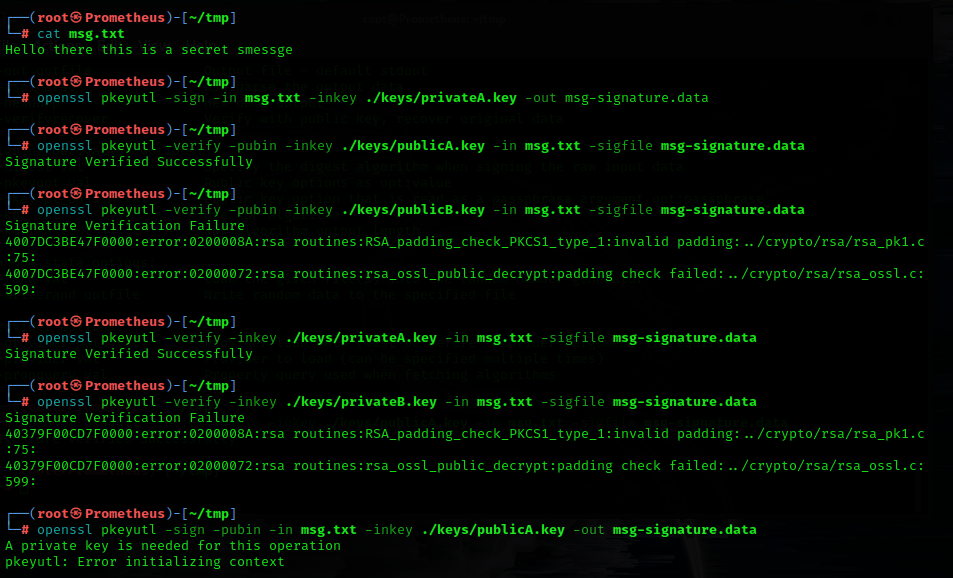

# Blockchain related topics and basic examples

## Asymmetric key system demo

 

* ### Key Generation in linux envionment
    

 

* ### Encryption using private key
    

 

* ### Encryption using public key
    

 

* ### Signature and verification
    